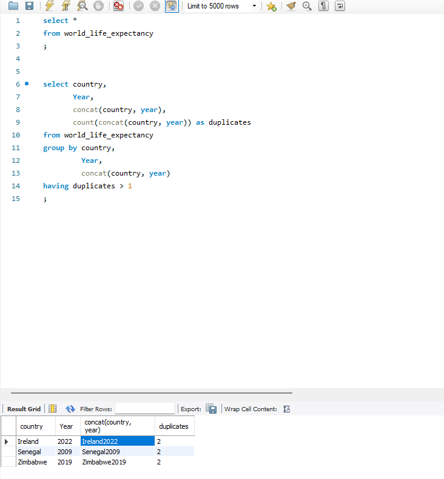
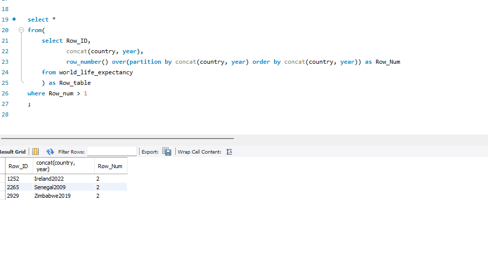
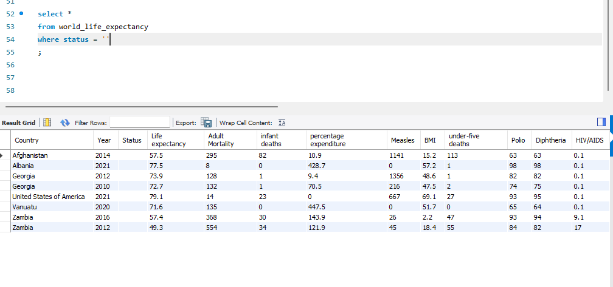
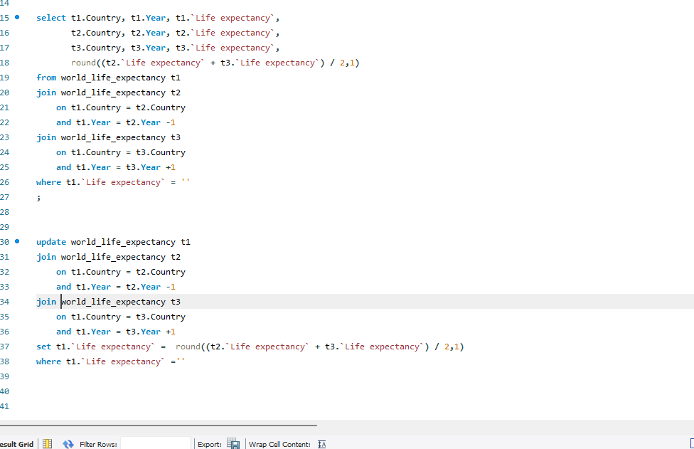
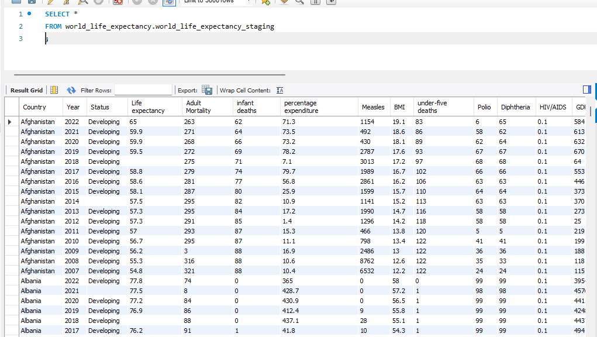

# ***Data-Cleaning In MySQL***

  Demonstrating data cleaning using MySQL using WorldLifeExpectancy.csv.

### ***Project Overview***

  For this project, I wanted to demonstrate my ability to clean a dataset in MySQL. The following will show that I understand how to clean data by searching for duplicates and removing them. I will also show that I can make corrections that fill in blank or null data with appropriate data. I will also show that I understand working with data and the need to keep a control dataset to compare to when updating information in the dataset.

### ***Data***

  The data used for this project is “WorldLifeExpectancy.csv” file. This dataset contains information for developing and developed nations around the world. The dataset contains information spanning from 2007 – 2022.

### ***Tools***

MySQL
  - Used to clean data and do a exploratory data analysis.

### ***Goals***

Clean Data:
  - Show an understanding of looking for and correcting errors in the dataset.

## ***Importing Data***

  To get started I Imported WorldLifeExpectancy.csv dataset to MySQL creating a schema named ‘world_life_expectancy.csv’. Then I imported the WorldLifeExpectancy.csv as second time and listed it as world_life_expectancy_staging as a control table.

## ***Duplicates***

  Frist thing I did was to search for duplicates. I noticed that there were a few countries that had duplicate listing. The data did not appear to have unique data column to check for duplicates. I needed to create a unique column to find any data duplicates by country. To do so I combined columns ‘country’ and ‘year’ to create the unique ID needed to find any duplicates. Then counted the newly created column for any count above 1. The result was three countries have duplicate data Ireland in 2022, Senegal in 2009, and Zimbabwe in 2019.

  Next, I needed to find the location to do duplicates and remove them from the dataset. To find the location of the duplicates I used a subquery to find the ‘Row_ID’ column where the duplicated data was located.

  To remove the identified Row_ID I used the subquery that was created to find the duplicate data in a ‘delete from’ query to update the world_life_expectancy dataset. This removed the three rows from the world_life_expectancy tables. If something needs to be referenced or checked in the future, then I could use the world_life_expectancy_staging dataset which is my control table with unmodified data.

## ***Blanks and Nulls***

  In the dataset the ‘status’ column has blank cells that could affect any data derived from this set. To identify blanks in the status column we will do a search where I use (status = ‘’) and not ‘null’ since there is nothing in the cell.

  To check what unique status is listed in the ‘status’ column before making any changes to the blank cells. This will help ensure data coherency and if there are any other discrepancies in the data that need to be addressed. As we see there are only two types ‘developing’ and ‘developed’ listed under the ‘status’ column.

  I needed to update the blank cells with the correct data. To do this I needed to create a join to itself. This was the only way that I could use the data to fill the blanks. Doing a simple update to fill in the blanks would not be possible. It would not know how to pull the correct data. The work around is to create a join to itself so you can pull the data from the second table to fill the first table with the correct corresponding data.

  Moving to the next area of concern in the dataset, the column ‘Life expectancy’ has several blank cells throughout the column. When it comes to data such as averages, percentages, or any integers proper permission needs to be given before changing or creating. This ensures that any data used is accurate. Looking at this data I determined that averaging the year before and year after the blank cell would give me an accurate number. I based this on the gradual increase through the years of data collected.

  There are two steps I took to complete this task. First, I needed to join the table to itself not just once but twice. When I joined them, I adjusted the tables by joining them with ‘County’ and ‘Year’, the ‘Year’ I added and adjustment of -1, +2 as seen in the photo below. This ensured that the data lined up correctly for me to find the average between columns in the join. Then I updated the dataset with the joins and set it to populate the blank cells with the average of the year before and after the blank cells.

## ***Before and After Cleaning***

  This concludes the initial data cleaning. Dataset cleaning can consist of many things. For our reasons with this dataset cleaning has finished. There still may be areas that need to be cleaned as we discover doing the exploratory phase. Also, when given a dataset and goals to meet the shareholder could want certain things correct such as renaming the column heads to match or to create new data using what is available in the dataset. Each project will have different goals to achieve based off the stakeholder’s goals.

  Below is a before and after of the dataset I worked with. The ‘Before’ is pulled from the control dataset that was not altered and the ‘after’ is pulled from the altered dataset.
                    

## ***Exploratory Data Analysis***

  At this point of working with the data we are wanting to run types or queries to ensure that the data is clean to the point we can use. With this dataset we find that there may be data quality issues when we look for the minimum and max life expectancy of each country where several countries have 0 in data used.

